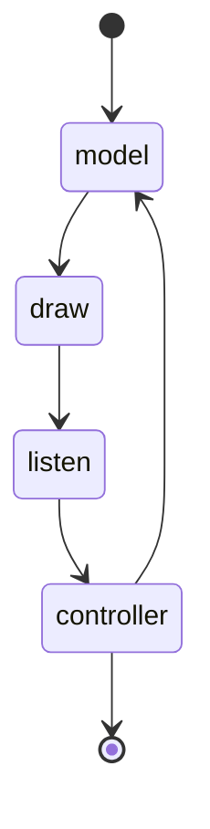
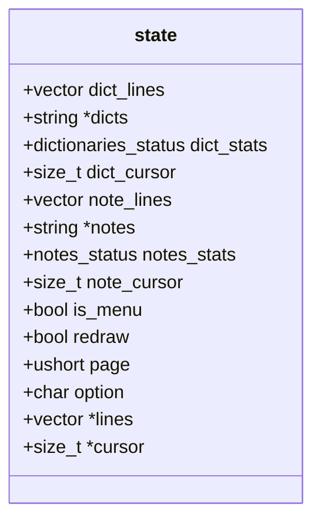
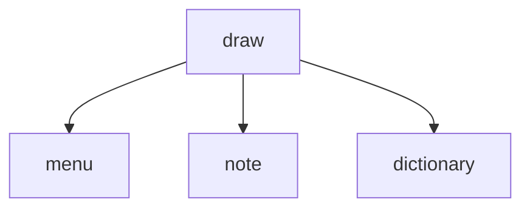
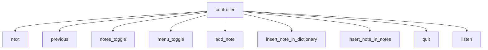

LinTerm
--
Descrição: aplicação de terminal para aprendizado de linguagem escrito em C.

Em "state/" é necessário prover um arquivo chamado "dictionary.csv" conténdo uma lista de palavras e atributos conforme a seguinte descrição por linha:

    "palavra=frequência=artigo=tipo-gramatical=definição=exemplo"

O separador usado, é: "=".

Compilação recomendada: gcc -Wall -Wextra -Wpedantic main.c -o main -lm.

todo:
- criar inteligence.csv
- reimplementar set
- ...

arquitetura:

estado:

páginas:

controlador:

